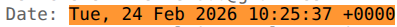
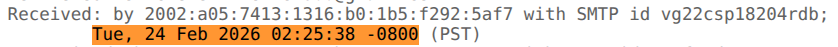
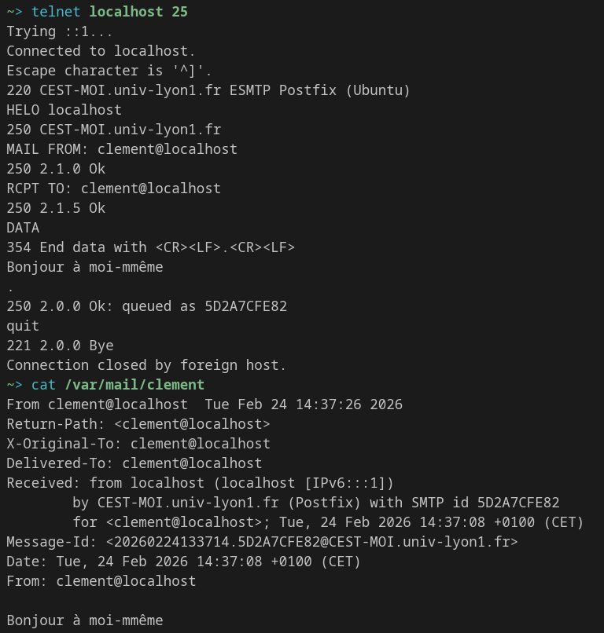
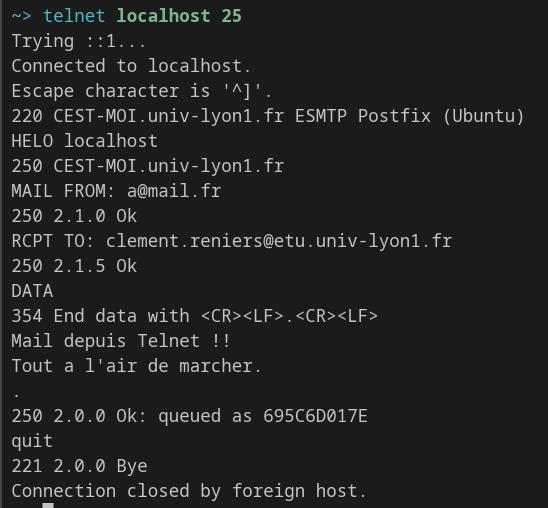
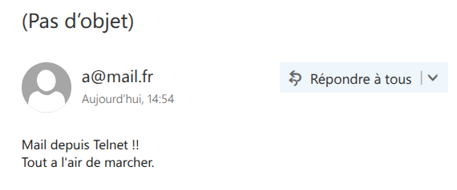
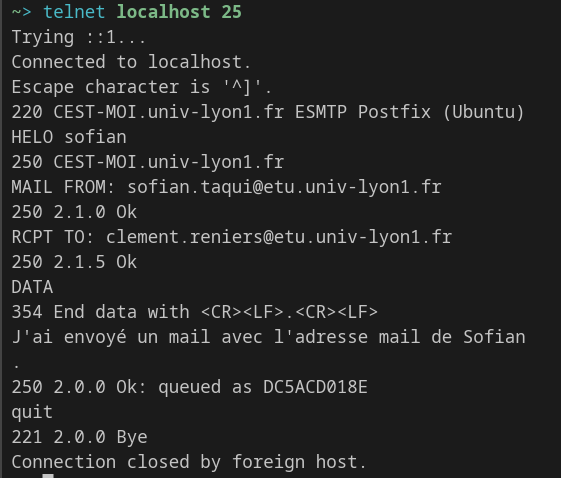
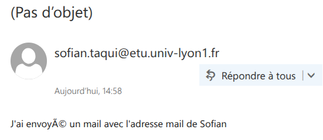

# Exercice 1
1. 

Les champs permettant de connaître l'expéditeur et le destinataire sont :

- Destinataire : `Delivered-To:`
- Expéditeur : `From`

2. 

Le champ `Return-Path` contient une adresse email qui est utilisée en cas d'erreur de livraison du message (par exemple si l'adresse mail n'existe pas). Si une erreur est présente, le message d'erreur sera envoyé à cette adresse.

3. 

Les champs `Received` contiennent des informations sur les serveurs mail qui ont traité le mail (ex: IP, date et heure de réception, ...).

4. 

Par exemple, le mail a été envoyé le `Tue, 24 Feb 2026 10:25:37 +0000`, et reçu le `Tue, 24 Feb 2026 02:25:38 -0800`, qui correspond à un temps de traitement de 1 seconde.

5. 

Pour vérifier qu'un utilisateur n'a pas usurpé l'identité d'un autre, on peut utiliser les champs `Received` notamment, qui permettent de retracer le chemin du mail et du serveur expéditeur.

# Exercice 3

1. 

On s'envoie un mail à `<user>@localhost` : 

2. 

\newpage

3. 

# Exercice 5

1. 

Un attaquant peut par exemple utiliser une attaque de type MITM (Man In The Middle), car les messages envoyés par le protocoles SMTP ne sont pas chiffrés.

2. 

Un attaquant peut par exemple capturer les identifiant et mot de passe d'un utilisateur en lisant les requêtes envoyées. Il peut également voler le cookie de sesssion de l'utilisateur pour se faire passer pour lui.

3. 

De la même manière qu'on a fait pour la question 1.3 de l'exercice 3, le champ de l'expéditeur est complètement libre : on peut y mettre n'importe quelle adresse mail.

# Exercice 6

1. 

Le serveur POP renvoie les réponses suivantes :

- `+OK` : la commande a été traitée avec succès.
- `-ERR` : la commande a échoué.

2. 

- `STAT` : affiche le nombre de messages et la taille totale de la boîte mail.
- `LIST` : affiche la liste des messages avec leur numéro et leur taille.
- `LIST <ENTIER>` : affiche la taille du message correspondant à `<ENTIER>`.

3. 

- `RETR <ENTIER>` : affiche le contenu du message correspondant à `<ENTIER>`.

- `TOP <ENTIER1> <ENTIER2>` : affiche les `<ENTIER2>` premières lignes du message correspondant à `<ENTIER1>`.

- `TOP <ENTIER1> 0` : affiche uniquement les en-têtes du message correspondant à `<ENTIER1>`.

4. 

- `DELE 1` : marque le message numéro 1 pour suppression.
- `LIST` : affiche la liste des messages avec leur numéro et leur taille.
- `RSET` : annule la suppression des messages marqués pour suppression.
- `LIST` : affiche la liste des messages avec leur numéro et leur taille.

Le message n'est réellement supprimé que lorsque la commande `QUIT` est envoyée.

5. 

La commande `NOOP`sert à pinger le server pour à la fois vérifier que la connexion est toujours active et la maintenir (permet également d'empêcher l'idling du serveur).

# Exercice 8

1. 

Le protocole POP n'est pas sécurisé : il transmet les identifiants et les messages en clair, ce qui peut être intercepté par un attaquant. À la place, il vaut mieux utiliser POP3S.

2. 

Oui, c'est théoriquement possible, mais dans la pratique, POP télécharge souvent les messages en local et peut les supprimer du serveur. Cela implique donc des potentiels problèmes de synchronisation ente les différents appareils.