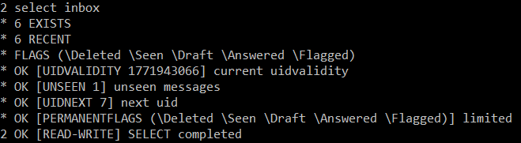
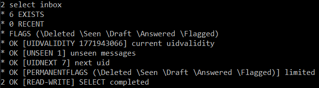
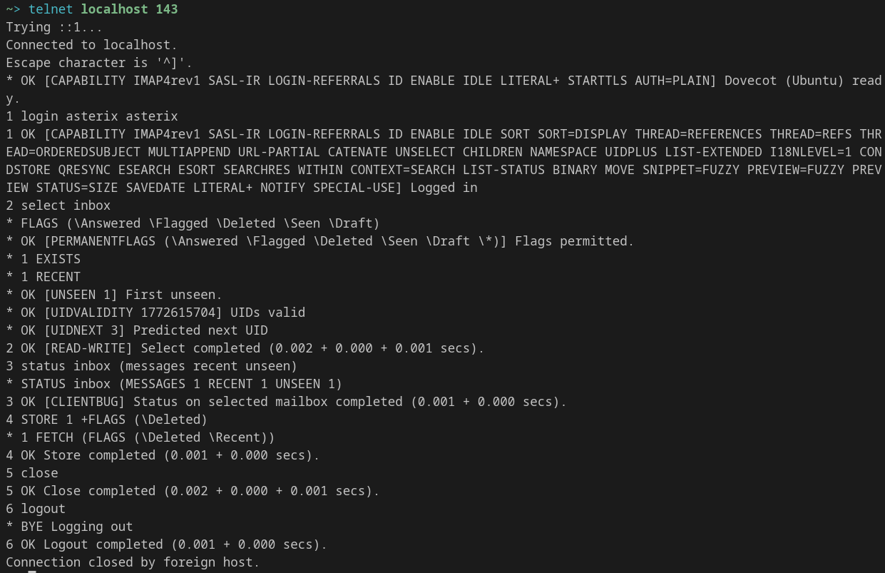

# Exercice 2
### Q1.1. Que renvoie `SELECT INBOX` ?

Ouverture de la boîte INBOX + statut :

  * `* 6 EXISTS` -> 6 messages dans INBOX
  * `* 0 RECENT` -> 0 message “recent”
  * `* FLAGS (...)` + `PERMANENTFLAGS (...)` -> drapeaux supportés
  * `OK [UNSEEN 1]` -> 1 message non lu
  * `OK [UIDNEXT 7]` / `OK [UIDVALIDITY ...]` -> infos UID
  * `OK [READ-WRITE] SELECT completed` -> boîte ouverte en lecture/écriture

  

### Q1.2. Le résultat a-t-il changé après reconnexion ? Pourquoi ?

* Oui. Lors de la première connexion, la commande SELECT INBOX renvoyait 6 EXISTS et 6 RECENT. Après reconnexion, le nombre de messages EXISTS reste le même (6), mais RECENT devient 0.



* Cela s’explique par le fait que le drapeau Recent indique les messages nouvellement arrivés qui n’ont pas encore été signalés à une session IMAP. Une fois qu’une session les a vus, ils ne sont plus considérés comme recent lors des connexions suivantes

### Q1.3. Rôle/comportement de `\Seen` et `\Recent`

* `\Seen` : message lu (flag persistant). Il reste jusqu’à modification (ex. via `STORE`).

  ![Résultat de SELECT INBOX après `FETCH 1 BODY[]`](./img/tp5-3.png)

* `\Recent` : message nouvellement arrivé “récent” (flag non persistant, géré par le serveur). Il disparaît après que la boîte a été vue/selon la logique serveur; il n’est pas fait pour être “stocké” comme Seen.

### Q1.4. À quoi sert `1:*` ? Comment récupérer le contenu d’un mail ?

* `1:*` = plage de numéros de messages, du message 1 jusqu’au dernier (`*`).
* Pour récupérer le contenu (pas juste les flags) :

  * Corps : `FETCH n BODY[]` (ou `BODY.PEEK[]` pour ne pas marquer Seen)

  ![Résultat de FETCH 1 BODY[]](./img/tp5-4.png)

  * En-têtes : `FETCH n BODY[HEADER]`

  ![Résultat de FETCH 1 BODY[HEADER]](./img/tp5-5.png)

### Q1.5. Séquence pour supprimer le 1er mail d’Astérix

```
1 LOGIN asterix asterix
2 SELECT INBOX
3 STATUS INBOX (MESSAGES RECENT UNSEEN)
4 STORE 1 +FLAGS (\Deleted)
5 CLOSE
6 LOGOUT
```


