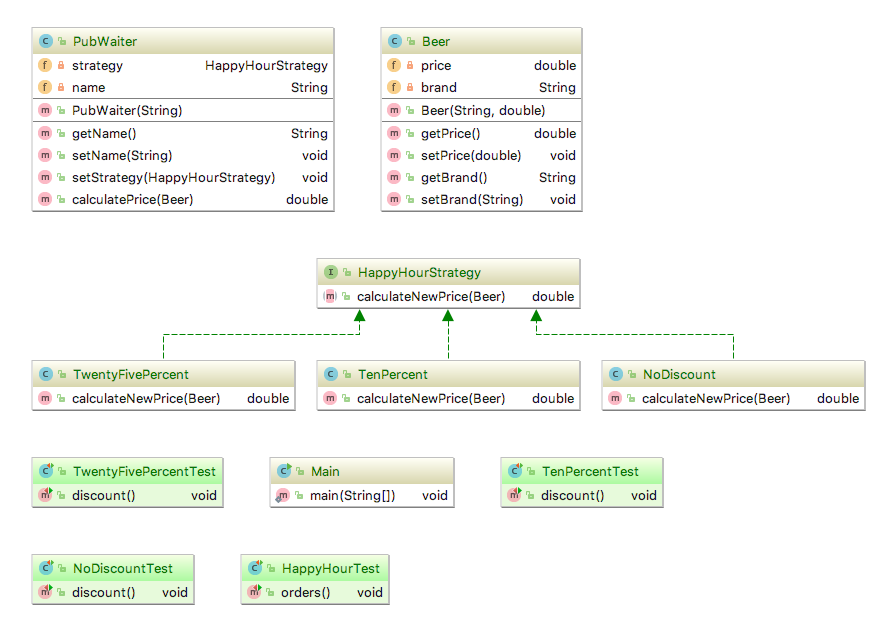

# ISI3 TP 1: Design Pattern Stratégie / Etat
Laëtitia Matignon

> Objectifs du TP
> - Comprendre et mettre en oeuvre les patterns Strategie et Etat
> - Vérifier l’application des principes OCP et DIP

## Exercice 1: Happy Hour 

**Enoncé**: Modéliser le concept d'happy hour dans un pub. Le serveur sert des bières sur lesquelles il peut appliquer des réductions.
- le serveur est le contexte
- les réductions sont les stratégies

**À faire**: dans le projet `/strategybeers`
- ajoutez le code nécessaire pour que les tests fonctionnent (exécutez la classe [classe HappyHourTest](src/strategybeers/HappyHourTest.java))
- ajoutez une réduction de 50%
- complétez la classe de test [classe HappyHourTest](src/strategybeers/HappyHourTest.java) et vérifier le bon fonctionnement de cette nouvelle réduction.

## Exercice 2: Calculette

**Enoncé/contexte**: Modéliser le concept d'une Calculette. 

### 2.1 Calculette "basique"

Un code d'une Calculette basique vous est donné dans la [classe Calculette](src/calculette/Calculette.java), ainsi qu'une classe  [classe Main](src/calculette/Main.java) qui l'utilise.

#### Question 1: Quelles sont les conséquences de l'ajout de nouvelles opérations (par ex. la multiplication) ? Que pouvez-vous en conclure concernant le respect du principe OCP par cette modélisation ?

### 2.2: Calculette et Stratégie

> Comment ajouter des opérations à la classe `Calculette` sans être obligé de la modifier à chaque fois ?

Proposer un _refactoring_ du code précédent dans le package [strategycalculette](src/strategycalculette/) en utilisant le pattern **Strategie**.

Les questions à vous poser:
- Quelle classe joue ici le rôle du Contexte, du Client ?
- Quelles sont les stratégies concrètes ?
- Qui instancie les stratégies concrètes ?
- Qui sélectionne la stratégie adaptée ?

#### Question 2: Donner le diagramme UML de votre solution.

#### Question 3: Quelles sont les conséquences de l'ajout de nouvelles opérations ? Que pouvez-vous en conclure concernant le respect du principe OCP par cette modélisation ?

#### Question 4: Expliquez comment l'utilisation du pattern Stratégie permet de respecter l'inversion des dépendances.

### 2.3: Calculette et Etat

> Comment le choix de l'opération effectuée par la `Calculette` peut être transparent au Client ?

#### Question 6: Quelles sont les différences entre le patron de conception Etat et le patron Stratégie ? 

Proposer un _refactoring_ du code précédent dans le package [etatcalculette](src/etatcalculette/) pour maintenant utiliser le pattern **Etat**.

Les questions à vous poser:
- Qui instancie les etats concrets ?
- Qui sélectionne l'état concret adapté ?

#### Question 5: Illustrer/Expliquer dans le cas de votre Calculette ce que cela implique comme modifications entre la calculette avec Stratégie et celle avec Etat.

#### Question 6: Quelles sont les conséquences de l'ajout de nouvelles opérations ? 

#### Question 7: Que pouvez-vous en conclure concernant le respect des principes OCP et DIP par votre modélisation ?

